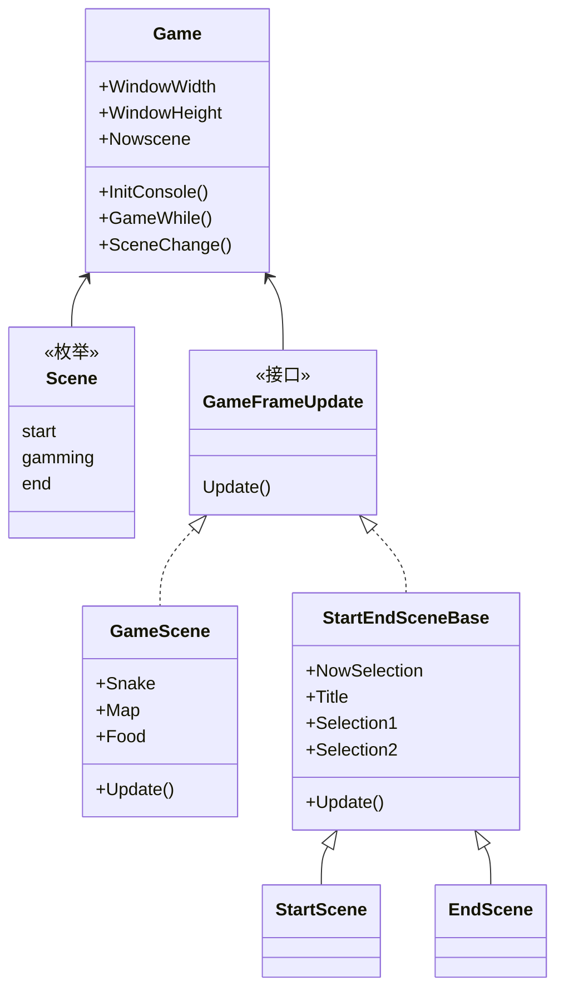
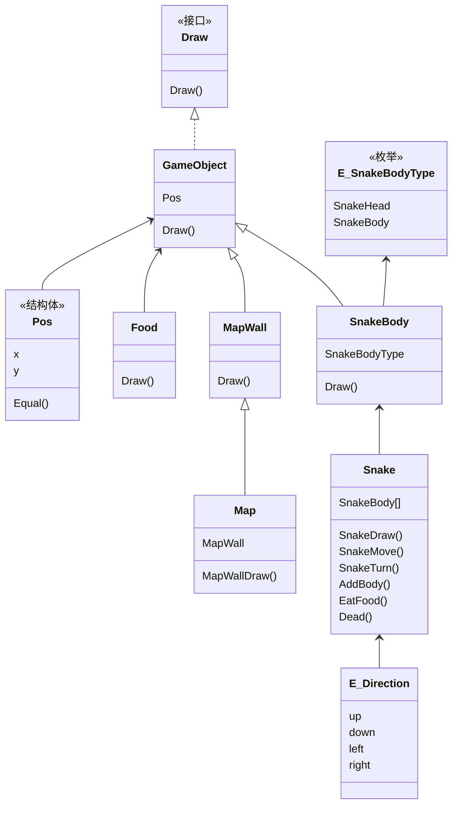

```mermaid
classDiagram
    class Scene{
        <<枚举>>
        start
        gamming
        end
    }

    class Game {
        +WindowWidth
        +WindowHeight
        +Nowscene
        +InitConsole()
        +GameWhile()
        +SceneChange()

    }
    
    class GameFrameUpdate{
    	<<接口>>
    	Update()
    }
    
    class GameScene{
    	+Snake
    	+Map
    	+Food
    	+Update()
    }
    class StartEndSceneBase{
    	+NowSelection
    	+Title
    	+Selection1
    	+Selection2
    	+Update()
    }
    Game <-- Scene
    Game <-- GameFrameUpdate
    GameFrameUpdate <|.. GameScene
    GameFrameUpdate <|.. StartEndSceneBase
	StartEndSceneBase <|-- StartScene
	StartEndSceneBase <|-- EndScene

```

```mermaid
classDiagram
    class Pos{
        <<结构体>>
        x
        y
        Equal()
    }

    class GameObject {
        Pos
        Draw()
    }
    
    class Draw{
    	<<接口>>
    	Draw()
    }
    
    class Food{
    	Draw()
    }
    class MapWall{
    	Draw()
    }
    class Map{
    	MapWall
    	MapWallDraw()
    }
    class E_SnakeBodyType{
    	<<枚举>>
    	SnakeHead
    	SnakeBody
    }
    class SnakeBody{
    	SnakeBodyType
    	Draw()
    }
    class Snake{
    	SnakeBody[]
    	SnakeDraw()
    	SnakeMove()
    	SnakeTurn()
    	AddBody()
    	EatFood()
    	Dead()
    }
    class E_Direction{
    	up
    	down
    	left
    	right
    }
    
    GameObject <-- Pos
    GameObject <-- Food
    Draw <|.. GameObject
    GameObject <|-- SnakeBody
    E_SnakeBodyType <-- SnakeBody
    SnakeBody <-- Snake
    Snake <-- E_Direction
	GameObject <|-- MapWall
	MapWall <|-- Map

```
