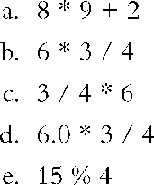

# 复习题
### 1.为什么C++有多种整形?
```C++
因为有多种需求
```
### 2．声明与下述描述相符的变量。
**a．short整数，值为80**
```C++
short a = 80;
```
**b．unsigned int整数，值为42110**
```C++
unsigned int b = 42110;
```
**c．值为3000000000的整数**
```C++
int c = 3000000000;
```

### 3．C++提供了什么措施来防止超出整型的范围？
```C++
使用了各种整形类型来限制,比如int,short,long等
```
### 4．33L与33之间有什么区别？
```C++
33L是long类型,而33是int类型
```
### 5．下面两条C++语句是否等价？

```C++
是等价的,65是A的ASCII码
```
### 6．如何使用C++来找出编码88表示的字符？指出至少两种方法。
```C++
方法一:
#include <iostream>
int main() {
	char ct = 88;
	std::cout << "答案是" << ct << std::endl;
	return 0;
}
方法二:
#include <iostream>
int main() {
	int num = 88;
	char ct = static_cast<char>(num);
	std::cout << "答案是" << ct << std::endl;
	return 0;
}
```
### 7．将long值赋给float变量会导致舍入误差，将long值赋给double变量呢？将long long值赋给double变量呢？
```C++
long赋值给double不会导致舍入误差,因为double能表示的值比long大  
long long也不会,因为double比long long能表示的值也更大
```
### 8．下列C++表达式的结果分别是多少？

```C++
a. 74
b. 4    //因为计算数都是整形数字,C++会自动向下取整
c. 0    //过程同上
d. 4,5  //因为其中有一个是浮点数
e. 3
```
### 9．假设x1和x2是两个double变量，您要将它们作为整数相加，再将结果赋给一个整型变量。请编写一条完成这项任务的C++语句。如果要将它们作为double值相加并转换为int呢？
```C++
第一个问题:
//double x1 = 1.0;
//double x2 = 2.0;
int ct = static_cast<int>(x1) + static_cast<int>(x2);
第二个问题:
//double x1 = 1.0;
//double x2 = 2.0;
int ct = x1 + x2;
```
### 10．下面每条语句声明的变量都是什么类型？

```C++
a.整形
b.浮点型
c.字符型
d.char32_t型 //因为'U'代表UTF-32字符
e.浮点型
```

<br>

<br>
<br>
<br>
<br>

####  2024/10/13